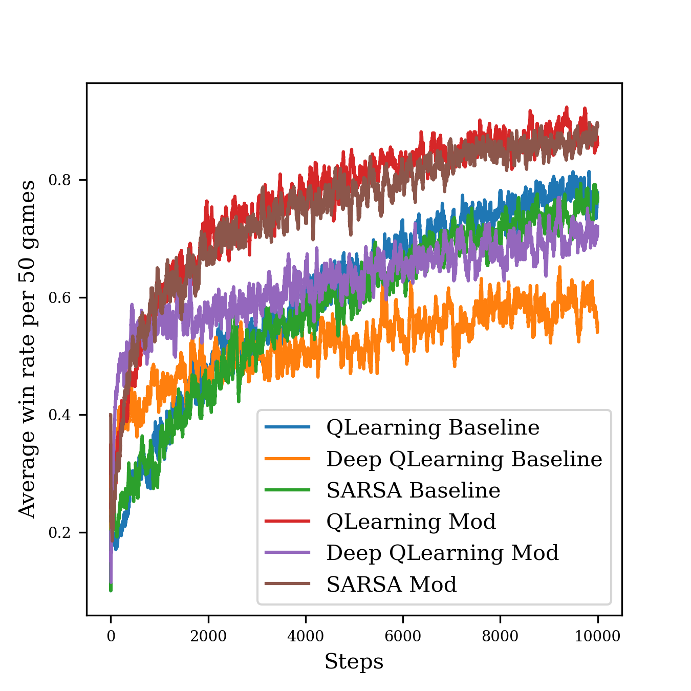

# Playing Chess with Reinforcement Learning

by Younghoon Kim (21-743-703) and Remo Hertig (13-738-323).

This repository contains the implementations for the assignment for Introduction to Reinforcement Learning, FS2022.



## Requirements

The code was developed and tested in Python 3.8.

You can install the dependencies for the codebase from the `requirements.txt`, using a package manager like PyPI:
```python
pip install -r requirements.txt
```


## Usage


### Replicate all experiments
```
./run_all.sh
```